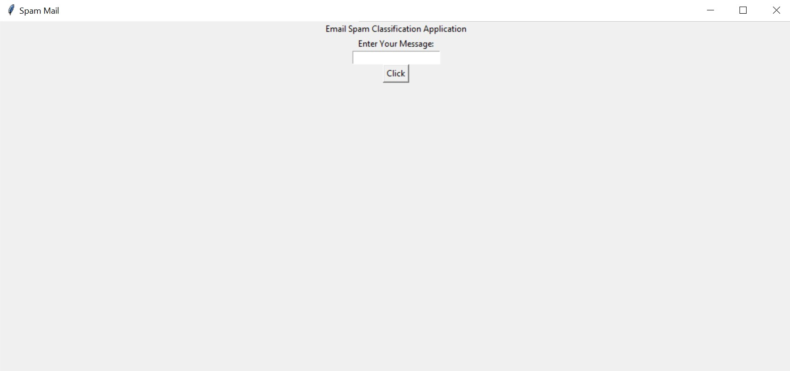

# Spam Email Classifier Application

## Screenshot


## Overview
The Spam Email Classifier is a machine learning-based application built using Python that determines whether an email message is spam or not. This application provides a simple graphical user interface (GUI) where users can enter an email message, and the model will classify it as spam or not spam.

## Features
- User-friendly GUI for email classification
- Uses a trained machine learning model to detect spam
- Provides instant classification results
- Implemented using Python and various machine learning libraries

## Requirements
To run this application, ensure you have the following installed:
- Python 3.x
- Jupyter Notebook
- Required libraries:
  - `pandas`
  - `numpy`
  - `sklearn`
  - `tkinter`

You can install the required dependencies using:
```bash
pip install pandas numpy scikit-learn
```

## Installation & Usage
1. Clone the repository or download the project files.
2. Open the `Email_spam_Model.ipynb` notebook to understand the model training process.
3. Run the main Python script to launch the GUI.
4. Enter an email message in the text box and click the "Click" button.
5. The application will display whether the message is spam or not spam.


## License
This project is licensed under the MIT License.

